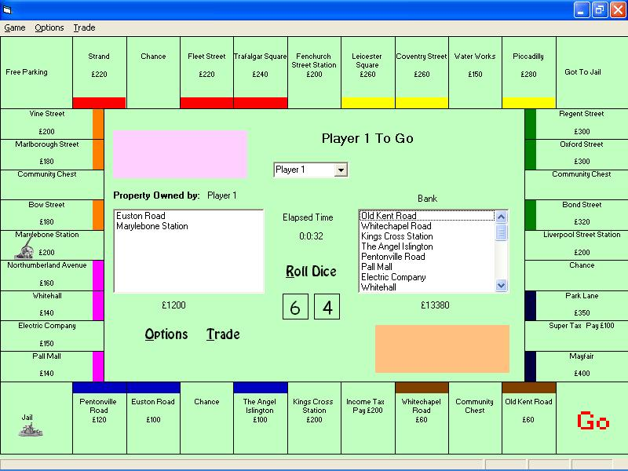



## An Adaptable Monopoly Game

### Description

A flexible monopoly game that stores all data in an Access database. It will allow the user to make alterations to both the content of the game such as property titles/prices/rents and card contents and to the appearance of the games’ user interface.

Players can buy/sell/mortgage/unmortgage property and buy/sell houses & hotels. There are also chance & Community Chest cards.

There’s no instructions or help system but I think the game is mostly self explanatory.

If you can alter 1 of the databases for another version/country etc. Please let me know and I'll include it in the next upload.

This programme won’t run at resolution of less than 800 x 600.

Please see new version "An Adaptable Monopoly Game *UPDATED*"
 
### More Info
 

             |
---                |---
**Submitted On**   |2002-12-21 11:55:06
**By**             |[David M Johnston](https://github.com/Planet-Source-Code/PSCIndex/blob/master/ByAuthor/david-m-johnston.md)
**Level**          |Intermediate
**User Rating**    |4.6 (55 globes from 12 users)
**Compatibility**  |VB 6\.0
**Category**       |[Games](https://github.com/Planet-Source-Code/PSCIndex/blob/master/ByCategory/games__1-38.md)
**World**          |[Visual Basic](https://github.com/Planet-Source-Code/PSCIndex/blob/master/ByWorld/visual-basic.md)
**Archive File**   |[A\_flexible15175312232002\.zip](https://github.com/Planet-Source-Code/david-m-johnston-an-adaptable-monopoly-game__1-41810/archive/master.zip)

